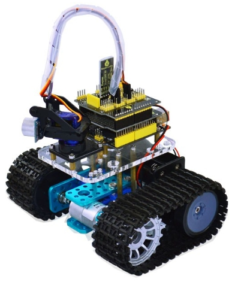

# BluetoothControlTank

The scatch has been adopted for Android application named Bluetooth Arduino Tank

Keyestudio mini tank | Android application
------------ | -------------
 | 

The android application UI provides 9 buttons for control

